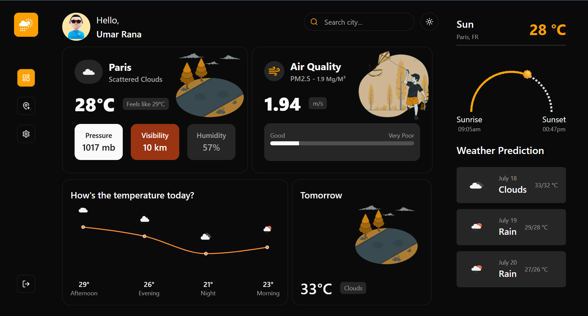

# 🌤️ WeatherPulse

**WeatherPulse** is a modern and responsive weather dashboard built with **Next.js 14 App Router**, **Tailwind CSS**, and **shadcn/ui**. It provides real-time weather updates, 5-day forecasts, air quality index, and UV risk level using the **OpenWeatherMap API**.

## 🚀 Features

- 🌎 Search weather by city
- ☀️ Real-time temperature, humidity, pressure, visibility
- 📅 5-day forecast (3-hour interval)
- 🌫️ Air Quality Index (AQI) & UV index display
- 🧭 Interactive weather illustrations and icons
- 🌗 Dark/Light mode toggle using `next-themes`
- 🎨 Beautiful UI with shadcn/ui components
- 🔍 Fully responsive and mobile-friendly

---

## 🧰 Tech Stack

- [Next.js 14](https://nextjs.org/)
- [Tailwind CSS](https://tailwindcss.com/)
- [shadcn/ui](https://ui.shadcn.com/)
- [OpenWeatherMap API](https://openweathermap.org/api)
- [lucide-react](https://lucide.dev/) (icons)
- [next-themes](https://github.com/pacocoursey/next-themes) (for dark mode)

---

## 🖼️ UI Preview



---

## ⚙️ Getting Started

### 1. Clone the repository

```bash
git clone https://github.com/yourusername/WeatherPulse.git
cd WeatherPulse
```

### 2. Install dependencies

```bash
npm install
```

### 3. Setup environment variables
 Create a .env.local file and add your OpenWeatherMap API key:
 
```env
OPENWEATHER_API_KEY=your_api_key_here
```

### 4. Run the development server

```bash
npm run dev
```
Visit http://localhost:3000 to view the app.

## 📁 Folder Structure

```bash
/app              → Next.js App Router pages and layouts
/components       → UI components (shadcn/ui)
/lib              → Utility functions (e.g., weather API)
public/           → Static assets (images, icons)
tailwind.config.ts → Tailwind theme config
```

## ✨ Author

**Muhammad Umar Rana**
- 📧 [umerrana2k05@gmail.com](umerrana2k05@gmail.com)
- 🔗 [/in/muhammad-umar-rana](https://linkedin.com/in/muhammad-umar-rana)
